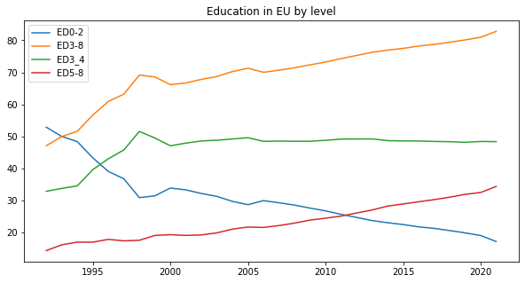

# European Educational Attainment
An exploratory study of data collected from EU countries (1992 to 2021) about the percentage of the population by educational attainment level, sex, and age. The analysis combines Python coding techniques with SQL datasets.

## Objective
The level of education is a factor that EU authorities have been taking track of since the very beginning of its creation. Other than being included in the factors that contribute to the general quality of life of each country, it reveals the level of education in Europe. Hence the main objective here is to analyze the level of education in various EU countries with Python and SQL by age, sex, and level. This is a small project that tries to combine these two coding languages in a unified approach to explore the data gathered and draw some conclusions about an important trend in EU countries. 

## Results

