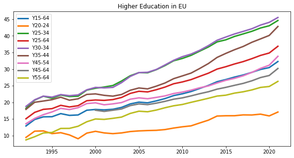
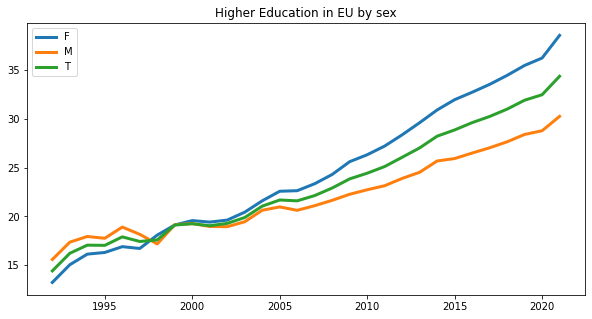

# European Educational Attainment
An exploratory study of data collected from EU countries (1992 to 2021) about the percentage of the population by educational attainment level, sex, and age. The analysis combines Python coding techniques with SQL datasets.

## Objective
The level of education is a factor that EU authorities have been taking track of since the very beginning of its creation. Other than being included in the factors that contribute to the general quality of life of each country, it reveals the level of education in Europe. Hence the main objective here is to analyze the level of education in various EU countries with Python and SQL by age, sex, and level. This is a small project that tries to combine these two coding languages in a unified approach to explore the data gathered and draw some conclusions about an important trend in EU countries. 

## Results
###Level of Education
Here are the labels that distinguish the various levels:
- Level 0 – Less than primary education
- Level 1 – Primary education
- Level 2 – Lower secondary education
- Level 3 – Upper secondary education
- Level 4 – Post-secondary non-tertiary education
- Level 5 – Short-cycle tertiary education
- Level 6 – Bachelor’s or equivalent level
- Level 7 – Master’s or equivalent level
- Level 8 – Doctoral or equivalent level

Overall we can see a positive trend: as an average in all countries being part of the EU the level of education is increasing, while the percentage of the population who attended less than primary education has been decreasing in the last 30 years. 
### Higer Education by Age

A similar trend can also be observed if data is aggregated by age ranges. 
### Higer Education by Sex

Interesting is the fact that approximately around the year 2000 the percentage of the female population concluding a higher education degree overcome that of the corresponding male population. Since that the growth seems to be even steeper.  
